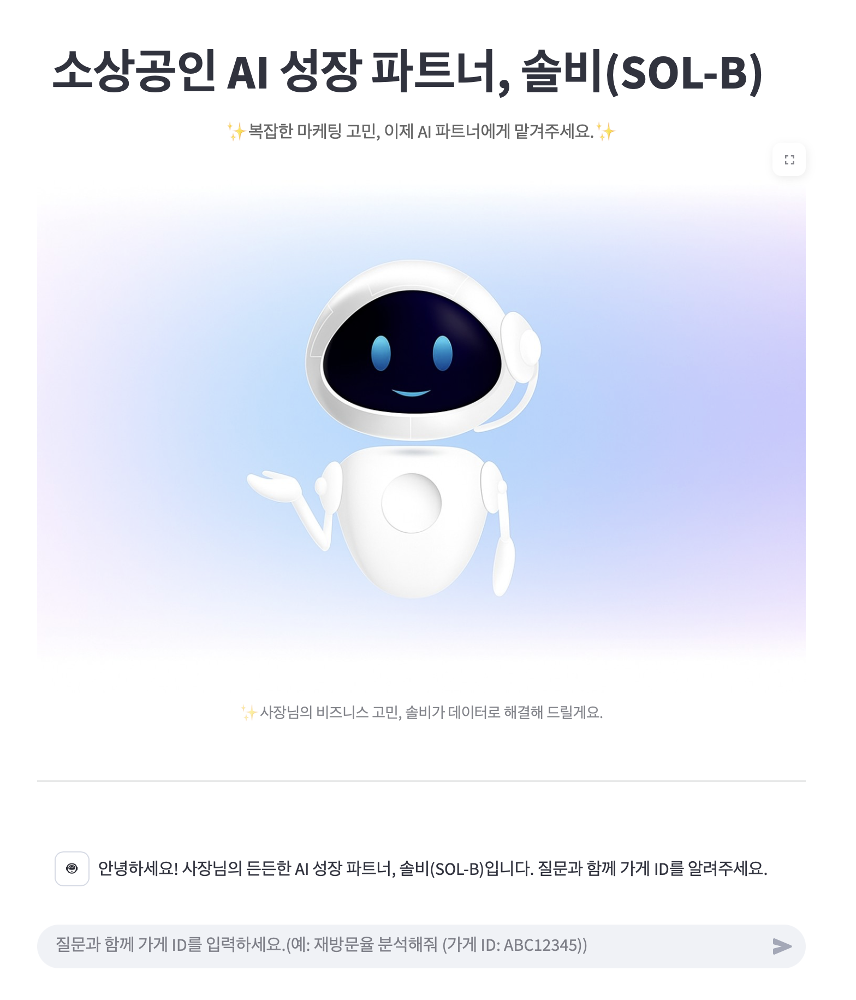

🏆 솔비(SOL-B): AI 성장 파트너, 솔비(SOL-B)
2025 신한카드 빅콘테스트 AI데이터 활용분야 출품작
       

솔비(SOL-B)는 LangGraph와 Google Gemini 2.5 Flash 모델을 기반으로, 소상공인의 효과적인 마케팅 전략 고민을 해결해주는 AI 에이전트입니다.    

점주의 질문을 AI가 스스로 분석하여 신한카드 데이터를 기반으로 하는 전문 분석 도구를 실행하고, 맞춤형 마케팅 전략을 도출합니다.   

✨ 1. 실시간 데모 (Live Demo)
아래 링크에서 Streamlit Cloud를 통해 배포된 '솔비(SOL-B)'를 직접 체험해볼 수 있습니다.

➡️ https://momentum3bigcontest.streamlit.app   

✨ 2. 핵심 기능
'솔비(SOL-B)'는 데이터 기반의 AI 에이전트로서, 점주의 질문을 분석하여 다음과 같은 맞춤형 컨설팅을 제공합니다.

1) 매출 및 고객 분석

2) 상권 맞춤 전략

3) 업종 특화 마케팅   

✨ 기술 스택 및 아키텍처
주요 기술 스택

Core: Python 3.11

Web Framework: Streamlit

AI/LLM: LangGraph (에이전트/라우터), LangChain (도구), langchain-google-genai (Gemini 2.5 Flash)

Data Handling: Pandas, Numpy

Utilities: Requests, Zipfile (클라우드 데이터 보안 로딩)   

✨ 시스템 아키텍처

본 프로젝트는 React(ReAct) 기반의 LangGraph 에이전트를 중심으로 설계되었습니다.  

[User] 사용자가 Streamlit UI에 질문 입력

[LangGraph Agent] Gemini LLM이 system_prompt와 질문을 기반으로 사고(Thought)

[LangGraph Agent] 5가지 분석 도구(tools.py) 중 현재 질문에 가장 적합한 도구를 단 하나 선택 (Tool Calling)  

[Tool] 선택된 도구가 Google Drive의 데이터로 Pandas 분석 수행 후 결과 반환

[LangGraph Agent] LLM이 분석 결과를 받아, 최종 보고서 형태로 가공  

[User] Streamlit UI에 최종 답변 출력   

✨ 로컬 개발 환경 구성 방법
1. 리포지토리 복제   

2. 가상 환경 생성 및 활성화
  
# Python 3.11 이상 권장
python3 -m venv venv
source venv/bin/activate
  
# (Windows의 경우)
python -m venv venv
venv\Scripts\activate
   
3. 라이브러리 설치

requirements.txt에 명시된 모든 라이브러리를 설치합니다.

pip install -r requirements.txt
(만약 uv 사용 시: uv pip install -r requirements.txt)
   
4. Streamlit Secrets 설정 (⚠️ 중요)

로컬에서 실행하려면 API 키와 데이터 URL이 필요합니다.
  
Bash
# .streamlit 폴더 생성
mkdir -p .streamlit
  
# secrets.toml 파일 생성 및 키 입력
  (YOUR_..._HERE 부분을 실제 값으로 대체)  
echo 'GOOGLE_API_KEY="YOUR_GOOGLE_API_KEY_HERE"' > .streamlit/secrets.toml   
echo 'DATA_ZIP_URL="YOUR_DATA_ZIP_URL_HERE"' >> .streamlit/secrets.toml  
GOOGLE_API_KEY: Google AI Studio에서 발급받은 API 키.  
  
DATA_ZIP_URL: 보안을 위해 GitHub에 올리지 않은 9개의 .csv 파일을 압축한 shc_data.zip 파일의 Google Drive 직접 다운로드 링크.
   
5. 로컬에서 실행
 
uv run streamlit run streamlit_app.py

✨ 라이선스 (License)
본 프로젝트는 MIT License를 따릅니다.
