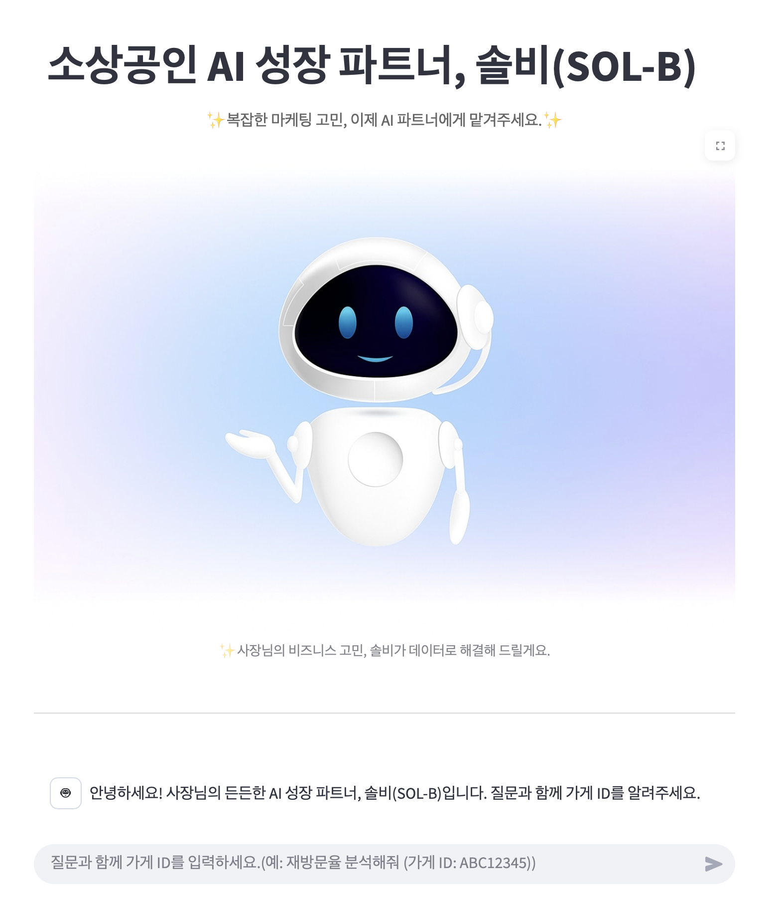
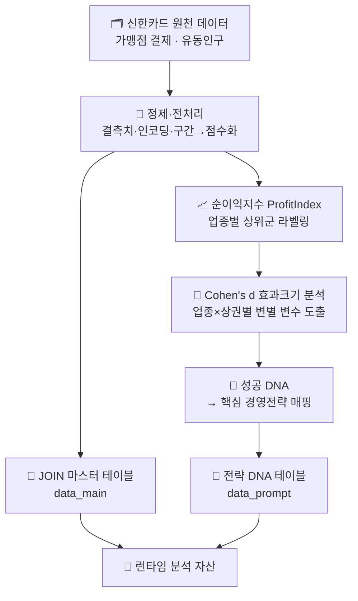
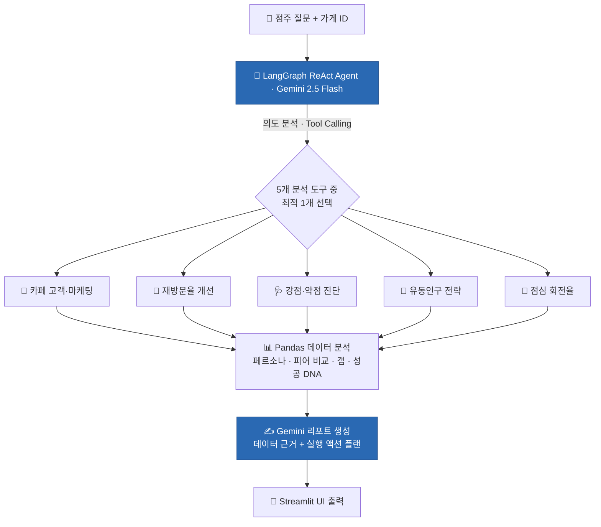

<div align="center">



# 🏆 솔비(SOL-B) — 소상공인 AI 성장 파트너

**2025 신한카드 빅콘테스트 · AI 데이터 활용분야 출품작**

실제 가맹점 결제·유동인구 데이터를 분석해, 점주의 질문에 **맞춤형 마케팅 전략**으로 답하는
LangGraph 기반 **AI 데이터 분석 에이전트**

<br>

[](https://momentum3bigcontest.streamlit.app)


</div>

---

## 📌 Overview

소상공인은 자신의 결제 데이터를 갖고 있어도 **"그래서 무엇을 해야 하는가"** 로 번역하지 못합니다.
**솔비(SOL-B)** 는 신한카드 가맹점 데이터를 분석해, 점주가 질문 한 줄만 던지면 **데이터 근거 + 즉시 실행 가능한 액션 플랜**을 리포트로 돌려주는 AI 에이전트입니다.

- 🧠 **LangGraph ReAct 에이전트** 가 질문 의도를 스스로 판단해 5개 분석 도구 중 최적 1개를 선택 (Tool Calling)
- 📊 선택된 도구가 **Pandas 로 실데이터 분석** — 페르소나 매핑 · 경쟁 그룹 비교 · 격차(Gap) 진단 · 성공 DNA 대입
- ✍️ 분석 결과를 **Gemini 2.5 Flash** 가 전문 컨설팅 리포트로 가공 → **Streamlit** 실시간 출력
- ☁️ Streamlit Cloud 배포 — [지금 바로 체험](https://momentum3bigcontest.streamlit.app)

---

## 🏗️ Architecture & Pipeline

### 1️⃣ 오프라인 — 데이터 엔지니어링 (성공 DNA 추출)

> 원천 결제 데이터에서 **업종×상권별로 "무엇이 상위 점포를 만드는가"** 를 통계적으로 규명해 전략 자산으로 변환합니다.


```mermaid
flowchart TD
    A["🗂️ 신한카드 원천 데이터<br/>가맹점 결제 · 유동인구"] --> B["🧹 정제·전처리<br/>결측치·인코딩·구간→점수화"]
    B --> C["📈 순이익지수 ProfitIndex<br/>업종별 상위군 라벨링"]
    C --> D["🧬 Cohen's d 효과크기 분석<br/>업종×상권별 변별 변수 도출"]
    D --> E["🎯 성공 DNA<br/>→ 핵심 경영전략 매핑"]
    B --> F["🔗 JOIN 마스터 테이블<br/>data_main"]
    E --> G["📑 전략 DNA 테이블<br/>data_prompt"]
    F --> H["🚀 런타임 분석 자산"]
    G --> H
```

### 2️⃣ 런타임 — AI 에이전트 (질문 → 분석 → 전략)


```mermaid
flowchart TD
    U["👤 점주 질문 + 가게 ID"] --> AG["🧠 LangGraph ReAct Agent · Gemini 2.5 Flash"]
    AG -->|"의도 분석 · Tool Calling"| T{"5개 분석 도구 중<br/>최적 1개 선택"}
    T --> T1["🎯 카페 고객·마케팅"]
    T --> T2["🔁 재방문율 개선"]
    T --> T3["🩺 강점·약점 진단"]
    T --> T4["🚶 유동인구 전략"]
    T --> T5["🍚 점심 회전율"]
    T1 --> P["📊 Pandas 데이터 분석<br/>페르소나 · 피어 비교 · 갭 · 성공 DNA"]
    T2 --> P
    T3 --> P
    T4 --> P
    T5 --> P
    P --> R["✍️ Gemini 리포트 생성<br/>데이터 근거 + 실행 액션 플랜"]
    R --> O["💬 Streamlit UI 출력"]
    classDef hi fill:#2A69B3,stroke:#1e4d8c,color:#ffffff;
    class AG,R hi;
```

---

## 🧰 핵심 분석 엔진 — 5 Tools

에이전트가 질문 의도에 따라 아래 도구 중 **정확히 하나** 를 실행합니다. 모든 리포트는 가맹점 기본 정보 블록 위에 데이터 근거를 명시합니다.

| 도구 | 트리거 | 분석 로직 |
|:--|:--|:--|
| 🎯 **카페 고객·마케팅** | `카페` + 고객·홍보 | 9개 연령·성별 **페르소나 매핑** → 상권 성공 DNA → 채널·홍보 액션 도출 |
| 🔁 **재방문율 개선** | 재방문율 `≤ 30%` | 3대 동인(가격·고객층·채널) **경쟁 그룹 비교** → 진단 페르소나 → A/B 전략 |
| 🩺 **강점·약점 진단** | 종합 문제점 진단 | 10개 지표를 **백분위 경영점수(0–100)** 로 환산 → 강·약점 → 솔루션 |
| 🚶 **유동인구 전략** | 지하철·출퇴근 | 시간대·요일 **유동인구 분석** → 재방문 유도 전략 |
| 🍚 **점심 회전율** | 직장인·점심시간 | 시간대 매출·직장인구 분석 → 점심 **회전율 극대화** 전략 |

---

## 🗃️ Data

9종 데이터셋(가맹점 결제 마스터 + 유동인구 7종 + 전략 DNA)을 기반으로 동작합니다.
원천 데이터는 **보안상 저장소에 포함하지 않으며**, 런타임에 Google Drive의 암호화 Zip에서 로드합니다.

| 구분 | 파일 | 설명 |
|:--|:--|:--|
| JOIN 마스터 | `data_main` | 가맹점 결제·고객·매출 지표 통합 테이블 |
| 전략 DNA | `data_prompt` | 업종×상권별 성공 DNA & 핵심 경영전략 |
| 유동인구 | `data_pop_*` | 성별·연령 / 요일 / 시간대 / 직장인구 (선택 상권 포함) |

---

## 🛠️ Tech Stack

| 분야 | 기술 |
|:--|:--|
| **Core** | Python 3.11 |
| **AI / Agent** | LangGraph (ReAct 에이전트·라우터) · LangChain (Tool) · Gemini 2.5 Flash |
| **Data** | Pandas · NumPy · Cohen's d(효과크기) · 백분위 스코어링 |
| **App** | Streamlit (UI·배포) · Requests · Zipfile (보안 데이터 로딩) |

---

## 🚀 Run Locally

```bash
# 1. 클론 & 가상환경 (Python 3.11+)
git clone https://github.com/AISWKimBeomSu/shcard_2025_bigcontest.git
cd shcard_2025_bigcontest
python3 -m venv venv && source venv/bin/activate   # Windows: venv\Scripts\activate

# 2. 의존성 설치
pip install -r requirements.txt

# 3. 시크릿 설정 (.streamlit/secrets.toml)
#   GOOGLE_API_KEY = "..."      # Google AI Studio 발급 키
#   DATA_ZIP_URL   = "..."      # 데이터 Zip 직접 다운로드 링크

# 4. 실행
streamlit run streamlit_app.py
```

---

## 👥 Team & License

- **2025 신한카드 빅콘테스트** AI데이터 활용분야 출품작 (Team Momentum)
- 데이터 파이프라인 설계 · LangGraph 에이전트/분석 도구 개발 · Streamlit 배포
- License: **Apache-2.0**
